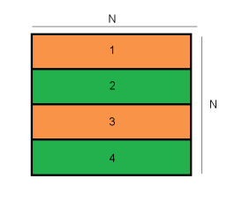
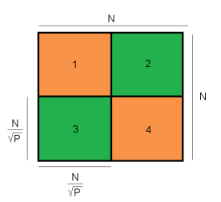

# Foxes and Rabbits - Ecosystem Simulation
This project involves simulating an ecosystem with two species: the Iberian fox (Vulpes vulpes) and the Iberian rabbit (Oryctolagus cuniculus).
The goal is to explore the benefits of parallel programming on both shared-memory and distributed-memory systems using OpenMP and MPI, respectively.


## Program Versions
There are four versions of the program, each implementing the simulation program in a different way:

1. **Serial**: Runs the simulation sequentially without parallelization.
2. **OpenMP**: Utilizes OpenMP for parallelization on shared-memory systems.
3. **MPI**: Employs MPI for parallelization on distributed-memory systems.
4. **Hybrid**: Combines OpenMP and MPI, providing parallelization on both shared-memory and distributed-memory systems.


## Requirements

### 1. Open Multithread-Processing (OpenMP)
This project uses the OpenMP library. Through OpenMP it is possible to exploit parallelism within a shared-memory system 
(for instance, your local computer).

OpenMP provides directives for defining parallel regions (independent work loads) and work-sharing constructs. These enable 
the creation of multiple threads which can then execute simultaneously smaller tasks within the same memory system.

To specify the number of threads during execution, you need to change the `OMP_NUM_THREADS` environment variable.

```
$ export OMP_NUM_THREADS=<number of threads>
```

Replace `<number of threads>` with the desired numbers of threads to be launched during execution.

For OpenMP documentation, see:
- https://www.openmp.org/
- http://gcc.gnu.org/projects/gomp
- https://computing.llnl.gov/tutorials/openMP/


### 2. Open Message Passing Interface (OpenMPI)
This project also utilizes the Message Passing Interface (MPI) implementation called OpenMPI.

MPI enables parallelization not only in shared-memory systems but also in distributed-memory systems, such as clusters of computers.

To execute the simulation across multiple computers, a cluster setup is required, but setting it up is beyond the scope of this repository.

To run the simulation using OpenMPI on a single machine, you can use the following command:

```
$ mpirun -n <number of processes> ./foxes-rabbits-mpi <simulation arguments>
```

Where `<number of processes>` specifies the desired number of MPI processes, and `<simulation arguments>` represents the necessary arguments for the simulation.

If you have a host file specifying the machines in your cluster, you can use the following command:

```
$ mpirun -n <number of processes> -hostfile <host filepath> ./foxes-rabbits-mpi <simulation arguments>
```

Replace `<host filepath>` with the path to your host file.

For OpenMPI documentation, see:
- http://www.mpi-forum.org
- http://www.open-mpi.org
- http://www.mcs.anl.gov/research/projects/mpi/www/www3


## Simulation Rules

The simulation takes place on a square grid containing cells. At the start, some of the cells are
occupied by either a rabbit, a fox, or a rock, the rest are empty. The simulation consists of computing
how the population evolves over discrete time steps (generations) according to certain rules.

A simplified version, for context, of the rules are as follows:

- **Rocks** don’t move and neither animal can occupy cells with rocks (they are too steep to climb).
- At each time step, a **rabbit** tries to move to a neighboring empty cell. If no neighboring cell is empty, it stays.
- At each time step, a **fox** moves to a cell containing a **rabbit**, eating it. When there are no **rabbits**, the **foxes**
move to an empty cell.
- Both **rabbits** and **foxes** move up or down, left or right, but not diagonally.
- Both animals have a breeding age, which will leave a child behind when reached.
- **Rabbits** do not suffer from starvation, while foxes need to eat a rabbit before dying from starvation.

The simulator progresses through a red-black scheme/organization:


This means that a single generation actually consists of two sub-generations. In the first sub-generation,
only the red cells are processed, and in the second sub-generation the black cells are processed.
The red-black scheme will help parallelize the computation of the cells. Cells of the same color
are diagonal to each other, while the animals can only move parallel to the axes.


For a more detailed version of the simulation rules, please consult 'project-description.pdf' inside the `docs` directory of this
repository.


## Program Execution

All four implementations are organized in this repository inside the `src` directory.
For simplicity, each implementation consists of a single source file and its respective makefile.
To compile a specific version, move to the corresponding directory inside the `src` directory and run the `make` command to generate the executable.

### Input Data
The program takes ten command line parameters, all positive integers:

```
$ ./foxes-rabbits <# generations> <M> <N> <# rocks> <# rabbits> <rabbit breeding> <# foxes> <fox breeding> <fox starvation> <seed>
```

Remember that for parallel implementions using OpenMP, you need to change the `OMP_NUM_THREADS` environment variable.

### Output Data
All implementations send to standard output, `stdout`, just three integers in one line separated
with one space in this order: the final number of **rocks**, **rabbits** and **foxes**.


## Implementation Considerations

In this section we will present our though process and strategies used to exploit parallelism in both OpenMP and MPI implementations.

### OpenMP
Parallelizing this simulation poses challenges due to the inherent dependency between generations. Each new generation relies on the state of the previous one, making it impossible to parallelize the computation of different generations.

One potential approach is to create a parallel region using `#pragma omp parallel` whenever a generation is computed. Within this region, the `#pragma omp for` directive can be used to distribute loop iterations among threads. However, this approach encounters issues, primarily race conditions where multiple threads attempt to write to the same cell. To address this, a critical region would need to be created, but this would result in seriously serializing the computation, leading to poor performance.

A better alternative is to consider a row composition of the matrix:



By considering a block of a few consecutive rows and assigning its processing to a single thread, race conditions between threads are minimized, though still existant near each block margins. Thus, each block is a task which is scheduled to be assigned by one of the running threads. The tasks have dependencies specified using the `#pragma omp task` construct and the `depend` clause. A set of non-coalescent tasks is created first (orange), followed by the remaining tasks (green). Due to the OpenMP constructs used, a green task will only be processed when the adjacent orange tasks have finished processing.


### MPI

One downside of the OpenMP implementation of the project is that maps had to be small enough to fit on
one machine. By creating a message passing version of the program we can utilize different machines, which
increases the amount of available resources, allowing us to solve very large maps.

There is also the possibility of splitting the matrix into
blocks with a certain number of rows and columns, i.e., a checkerboard decomposition:



This approach is more
complex, as now processes will have to not only communicate rows to the processes above and below them,
but also columns to the processes to the left and right and even some corner cells to processes diagonal to them.

This is however, generally, a much more scalable approach, as, with the world split this way, the amount of
communication processes have to make reduces as the number of processes increase. To reduce even further the
communication between processes, we have adopted **ghost buffers** for data cells of different processes. By temporarly
keeping copies of some of the rows and columns of different processes, it is possible to perform more computation before
having to communicate again with the adjacent processes.

Communication was done by first copying
the required rows/columns to a buffer and then utilizing the `MPI_Irecv` and `MPI_Isend` functions to send that
data to the right processes. `MPI_Waitall` is used to ensure that all messages have been sent and received before
moving on to computation.

### Hybrid (OpenMP + MPI)

The hybrid implementation combines both stategies adopted from OpenMP and OpenMPI.


## Perfomance Analysis

## MPI

We have measured the advantages of adopting MPI parallelism methodologies by running multiple simulations, each with a different set of parameters.
The considered simulation parameters are as follows in the table below:


For reference, we have run each test multiple times. We used the serial implementation as reference, and with each execution we increased the number
of processes launched.

The following table shows the execution times and speedups obtained for 8, 16, 32 and 64 processes (inside the parenthesis are the total number of machines):


Note that no serial time is provided for the final 3 tests as they are too big to fit on a single machine. Thus, the shown speedup is the speedup relative to the 8 process execution time.


